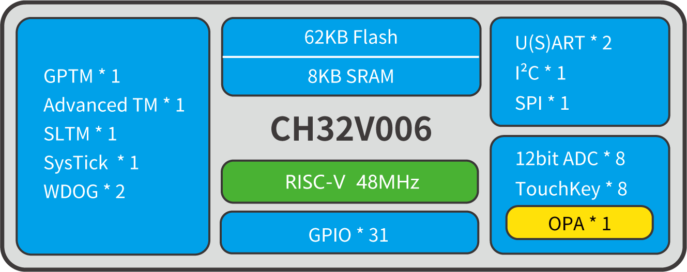
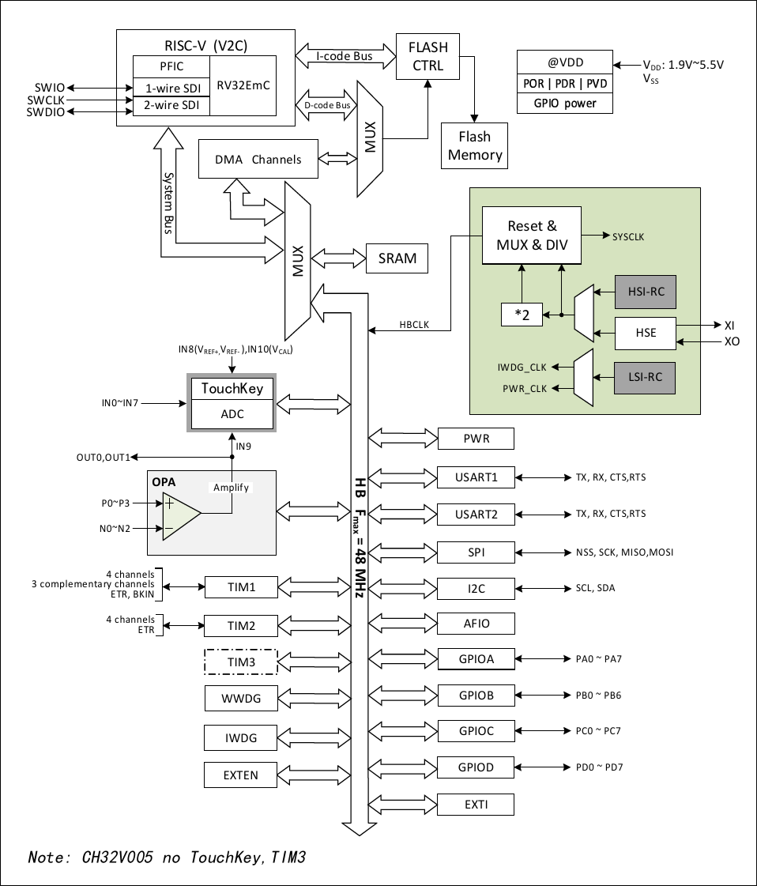

# CH32V006

## Official Site

## Datasheet
- en [[CH32V002DS0.PDF](https://ch32-riscv-ug.github.io/CH32V006/datasheet_en/CH32V002DS0.PDF)] [[CH32V004DS0.PDF](https://ch32-riscv-ug.github.io/CH32V006/datasheet_en/CH32V004DS0.PDF)] [[CH32V006DS0.PDF](https://ch32-riscv-ug.github.io/CH32V006/datasheet_en/CH32V006DS0.PDF)] [[CH32V00XRM.PDF](https://ch32-riscv-ug.github.io/CH32V006/datasheet_en/CH32V00XRM.PDF)]
- zh [[CH32V002DS0.PDF](https://ch32-riscv-ug.github.io/CH32V006/datasheet_zh/CH32V002DS0.PDF)] [[CH32V004DS0.PDF](https://ch32-riscv-ug.github.io/CH32V006/datasheet_zh/CH32V004DS0.PDF)] [[CH32V006DS0.PDF](https://ch32-riscv-ug.github.io/CH32V006/datasheet_zh/CH32V006DS0.PDF)] [[CH32V00XRM.PDF](https://ch32-riscv-ug.github.io/CH32V006/datasheet_zh/CH32V00XRM.PDF)]

## System Block Diagram

## System Architecture

## Comparison
