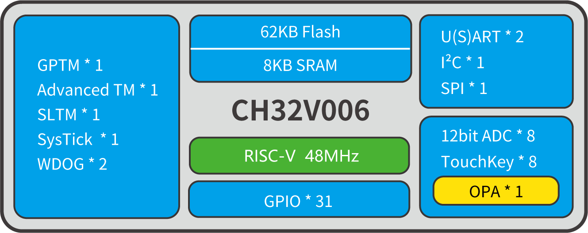
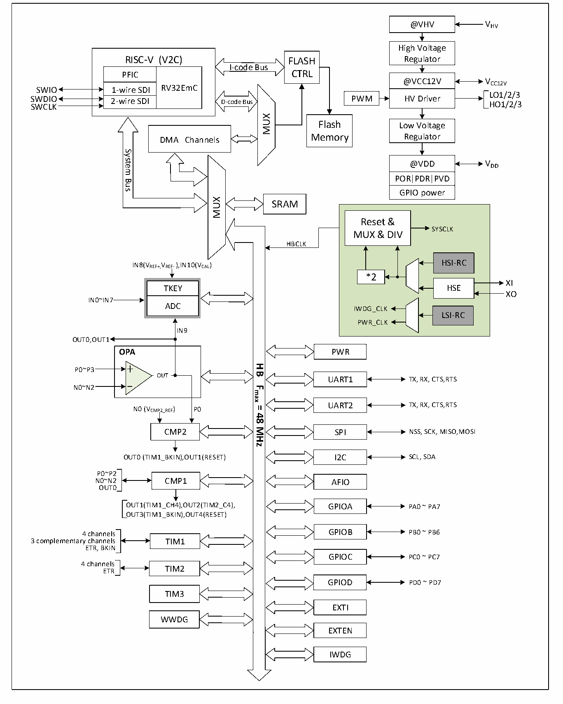
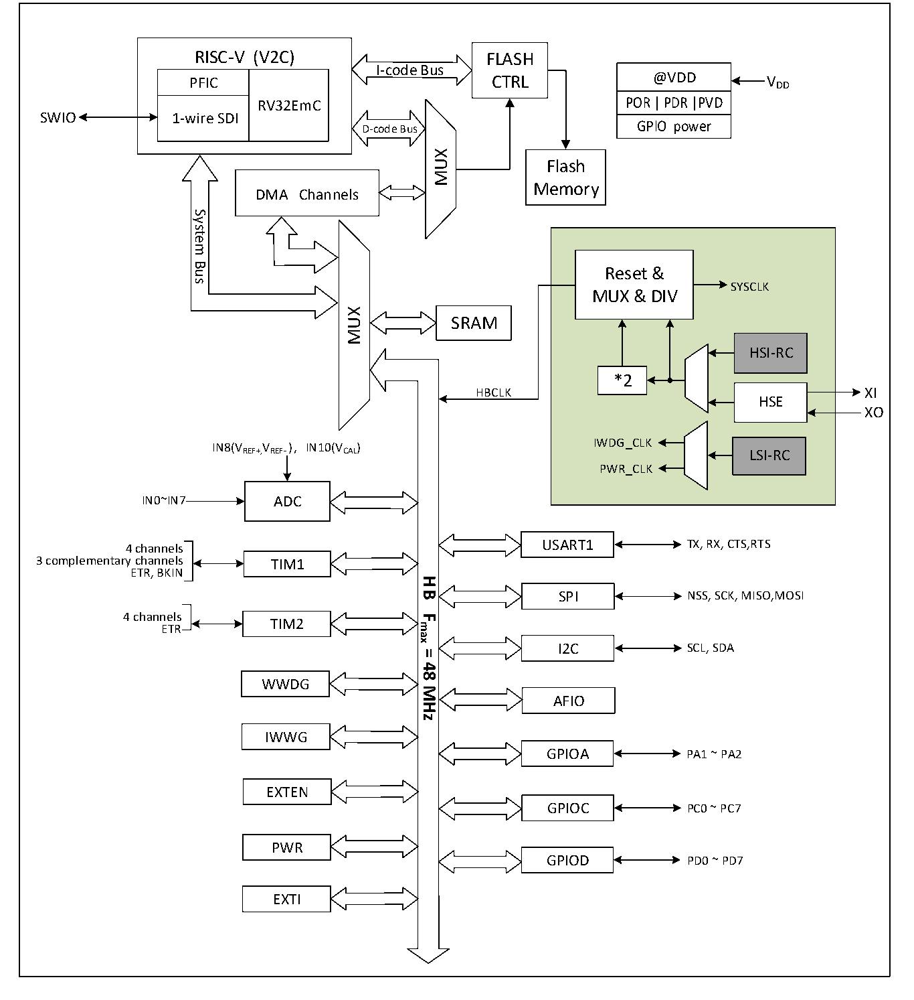
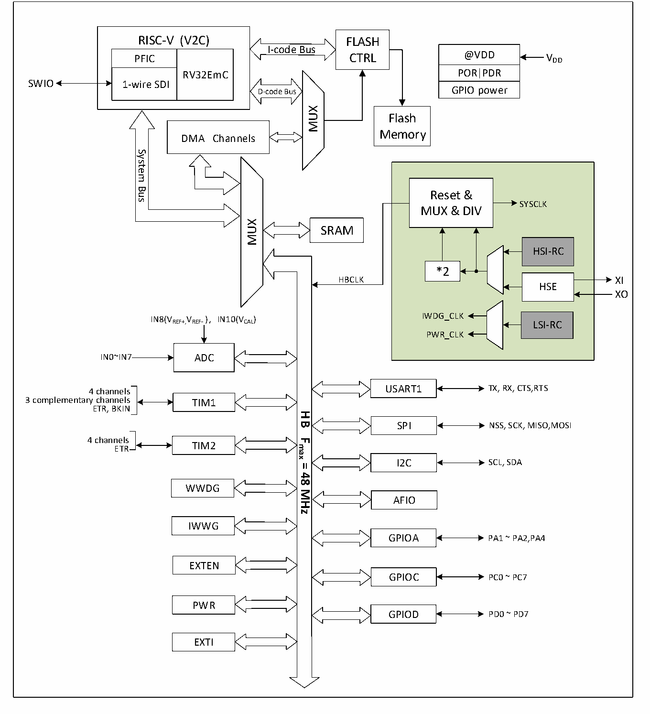
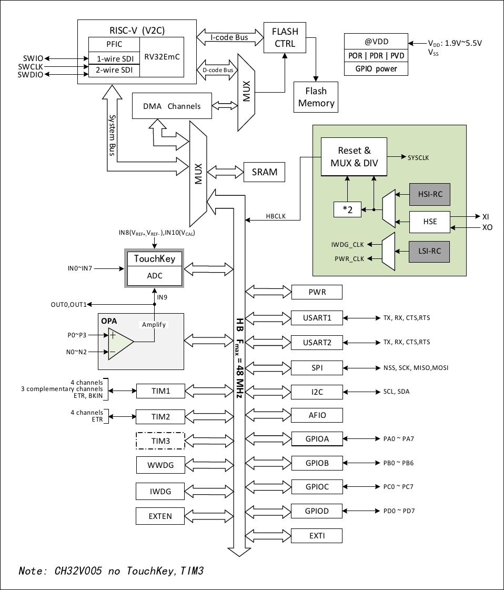
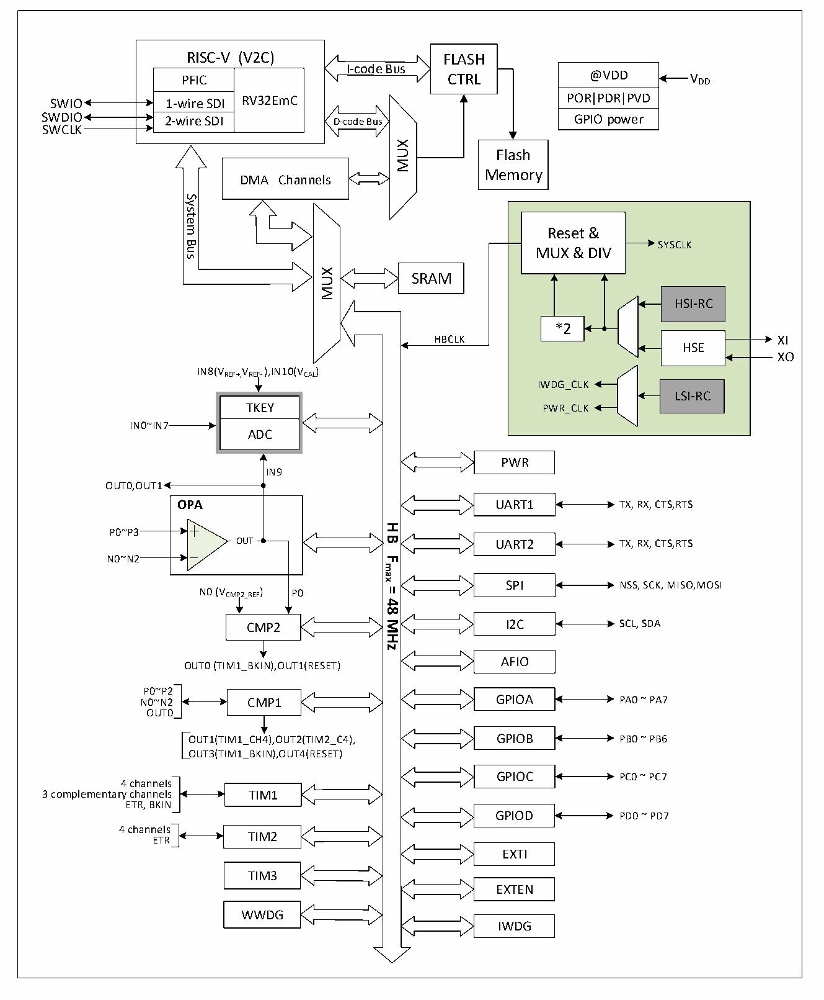

# CH32V006

<!-- This file is generated from ch32-riscv-ug/ch32-device-data (tables/ + tools/build_readme.py). Edit there, not here. -->

## Series

| Series | Core | ISA | Flash | SRAM | Max clock | VDD | Packages | Products | Official |
|---|---|---|---|---|---|---|---|---|---|
| **CH32M007** | QingKe V2C | RV32EmC | 62K | 8K | 48 MHz | 2.0-5.5V | QFN26C3,QFN32,QSOP24,QSOP28 | 4 | [en](https://www.wch-ic.com/products/CH32M007.html) / [zh](https://www.wch.cn/products/CH32M007.html) |
| **CH32V002** | QingKe V2C | RV32EmC | 16K | 4K | 48 MHz | 2.0-5.5V | QFN12,QFN20,SOP16,SOP8,TSSOP20 | 5 | [en](https://www.wch-ic.com/products/CH32V002.html) / [zh](https://www.wch.cn/products/CH32V002.html) |
| **CH32V004** | QingKe V2C | RV32EmC | 32K | 6K | 48 MHz | 2.7-5.5V | QFN20L,TSSOP20 | 2 | [en](https://www.wch-ic.com/products/CH32V004.html) / [zh](https://www.wch.cn/products/CH32V004.html) |
| **CH32V005** | QingKe V2C | RV32EmC | 32K | 6K | 48 MHz | 2.0-5.5V | QFN12,QFN20,QSOP24,TSSOP20 | 4 | [en](https://www.wch-ic.com/products/CH32V005.html) / [zh](https://www.wch.cn/products/CH32V005.html) |
| **CH32V006** | QingKe V2C | RV32EmC | - | - | 48 MHz | 2.0-5.5V | QFN12,QFN20,QFN32,QSOP24,TSSOP20 | 7 | [en](https://www.wch-ic.com/products/CH32V006.html) / [zh](https://www.wch.cn/products/CH32V006.html) |
| **CH32V007** | QingKe V2C | RV32EmC | 62K | 8K | 48 MHz | 2.0-5.5V | QFN32,QSOP24 | 4 | [en](https://www.wch-ic.com/products/CH32V007.html) / [zh](https://www.wch.cn/products/CH32V007.html) |

## Debug / serial defaults

| Series | SWDIO | SWCLK | UART TX | UART RX |
|---|---|---|---|---|
| CH32M007 | PD1 | PB3 | PD5 | PD6 |
| CH32V002 | PD1 | - | PD5 | PD6 |
| CH32V004 | PD1 | - | PD5 | PD6 |
| CH32V005 | PD1 | - | - | - |
| CH32V006 | PD1 | - | - | - |
| CH32V007 | PD1 | PB3 | PD5 | PD6 |

## Documents

| Document | Kind | English | 中文 |
|---|---|---|---|
| CH32V002DS0.PDF | datasheet | [page](https://www.wch-ic.com/downloads/CH32V002DS0_PDF.html) [mirror](https://ch32-riscv-ug.github.io/CH32V006/datasheet_en/CH32V002DS0.PDF) v1.7 | [page](https://www.wch.cn/downloads/CH32V002DS0_PDF.html) [mirror](https://ch32-riscv-ug.github.io/CH32V006/datasheet_zh/CH32V002DS0.PDF) v1.7 |
| CH32V004DS0.PDF | datasheet | [page](https://www.wch-ic.com/downloads/CH32V004DS0_PDF.html) [mirror](https://ch32-riscv-ug.github.io/CH32V006/datasheet_en/CH32V004DS0.PDF) v1.9 | [page](https://www.wch.cn/downloads/CH32V004DS0_PDF.html) [mirror](https://ch32-riscv-ug.github.io/CH32V006/datasheet_zh/CH32V004DS0.PDF) v1.9 |
| CH32V006DS0.PDF | datasheet | [page](https://www.wch-ic.com/downloads/CH32V006DS0_PDF.html) [mirror](https://ch32-riscv-ug.github.io/CH32V006/datasheet_en/CH32V006DS0.PDF) v2.0 | [page](https://www.wch.cn/downloads/CH32V006DS0_PDF.html) [mirror](https://ch32-riscv-ug.github.io/CH32V006/datasheet_zh/CH32V006DS0.PDF) v2.0 |
| CH32V006DS2.PDF | datasheet | - | [page](https://www.wch.cn/downloads/CH32V006DS2_PDF.html) [mirror](https://ch32-riscv-ug.github.io/CH32V006/datasheet_zh/CH32V006DS2.PDF) v1.1 |
| CH32V007DS0.PDF | datasheet | [page](https://www.wch-ic.com/downloads/CH32V007DS0_PDF.html) [mirror](https://ch32-riscv-ug.github.io/CH32V006/datasheet_en/CH32V007DS0.PDF) v1.8 | [page](https://www.wch.cn/downloads/CH32V007DS0_PDF.html) [mirror](https://ch32-riscv-ug.github.io/CH32V006/datasheet_zh/CH32V007DS0.PDF) v1.8 |
| CH32V00XRM.PDF | reference-manual | [page](https://www.wch-ic.com/downloads/CH32V00XRM_PDF.html) [mirror](https://ch32-riscv-ug.github.io/CH32V006/datasheet_en/CH32V00XRM.PDF) v1.5 | [page](https://www.wch.cn/downloads/CH32V00XRM_PDF.html) [mirror](https://ch32-riscv-ug.github.io/CH32V006/datasheet_zh/CH32V00XRM.PDF) v1.5 |
| CH32V006EVT.ZIP | evt | - | [page](https://www.wch.cn/downloads/CH32V006EVT_ZIP.html) [mirror](https://github.com/ch32-riscv-ug/CH32V006/tree/main/EVT) v1.4 |

## Product comparison

### CH32M007 product comparison

| | CH32M007&#8203;E8R6&#8203;(QSOP24) | CH32M007&#8203;E8U7&#8203;(QFN26C3) | CH32M007&#8203;G8R6&#8203;(QSOP28) | CH32M007&#8203;K8U7&#8203;(QFN32) |
|---|---|---|---|---|
| **Flash** | 62K | 62K | 62K | 62K |
| **SRAM** | 8K | 8K | 8K | 8K |
| **GPIO** | 15 | 16 | 12 | 17 |
| **Temperature** | -40..85C | -40..105C | -40..85C | -40..105C |
| ADC | 7+2 | 7+2 | 7+2 | 7+2 |
| ADTM | 1 | 1 | 1 | 1 |
| CMP | 2 | 2 | 2 | 2 |
| GPTM | 1 | 1 | 1 | 1 |
| I2C | 1 | 1 | 1 | 1 |
| OPA | 1 | 1 | 1 | 1 |
| OPA Polling | 3 | 3 | 3 | 3 |
| Serial port | 2 | 2 | 2 | 2 |
| SPI | 1 | 1 | 1 | 1 |
| Streamlined timer | 1 | 1 | 1 | 1 |
| Structure | P+N | P+N | N+N | N+N |
| Three-phase pre-drive Voltage | 24V | 24V | 48V | 48V |
| Touch-key button | 7 | 7 | 7 | 7 |
| Watchdog | 2 | 2 | 2 | 2 |

### CH32V002 product comparison

| | CH32V002&#8203;A4M6&#8203;(SOP16) | CH32V002&#8203;D4U6&#8203;(QFN12) | CH32V002&#8203;F4P6&#8203;(TSSOP20) | CH32V002&#8203;F4U6&#8203;(QFN20) | CH32V002&#8203;J4M6&#8203;(SOP8) |
|---|---|---|---|---|---|
| **Flash** | 16K | 16K | 16K | 16K | 16K |
| **SRAM** | 4K | 4K | 4K | 4K | 4K |
| **GPIO** | 14 | 11 | 18 | 18 | 6 |
| **Temperature** | -40..85C | -40..85C | -40..85C | -40..85C | -40..85C |
| ADC | 6+2 | 4+2 | 8+2 | 8+2 | 6+2 |
| ADTM | 1 | 1 | 1 | 1 | 1 |
| GPTM | 1 | 1 | 1 | 1 | 1 |
| I2C | 1 | 1 | 1 | 1 | 1 |
| Serial port | 1 | 1 | 1 | 1 | 1 |
| SPI | 1 | - | 1 | 1 | - |
| Watchdog | 2 | 2 | 2 | 2 | 2 |

### CH32V004 product comparison

| | CH32V004&#8203;F6P1&#8203;(TSSOP20) | CH32V004&#8203;F6U1&#8203;(QFN20L) |
|---|---|---|
| **Flash** | 32K | 32K |
| **SRAM** | 6K | 6K |
| **GPIO** | 18 | 18 |
| ADC | 8+2 | 8+2 |
| ADTM | 1 | 1 |
| GPTM | 1 | 1 |
| I2C | 1 | 1 |
| Serial port | 1 | 1 |
| SPI | 1 | 1 |
| Watchdog | 2 | 2 |

### CH32V005 product comparison

| | CH32V005&#8203;D6U6&#8203;(QFN12) | CH32V005&#8203;E6R6&#8203;(QSOP24) | CH32V005&#8203;F6P6&#8203;(TSSOP20) | CH32V005&#8203;F6U6&#8203;(QFN20) |
|---|---|---|---|---|
| **Flash** | 32K | 32K | 32K | 32K |
| **SRAM** | 6K | 6K | 6K | 6K |
| **GPIO** | 11 | 22 | 18 | 18 |
| **Temperature** | -40..85C | -40..85C | -40..85C | -40..85C |
| ADC | 4+2 | 8+2 | 8+2 | 8+2 |
| ADTM | 1 | 1 | 1 | 1 |
| GPTM | 1 | 1 | 1 | 1 |
| I2C | 1 | 1 | 1 | 1 |
| OPA | 1 | 1 | 1 | 1 |
| Serial port | 2 | 2 | 2 | 2 |
| Watchdog | 2 | 2 | 2 | 2 |
| SPI | - | 1 | 1 | 1 |

### CH32V006 product comparison

| | CH32V006&#8203;D8U7&#8203;(QFN12) | CH32V006&#8203;E8R6&#8203;(QSOP24) | CH32V006&#8203;E8R7&#8203;(QSOP24) | CH32V006&#8203;F4U6&#8203;(QFN20) | CH32V006&#8203;F8P7&#8203;(TSSOP20) | CH32V006&#8203;F8U7&#8203;(QFN20) | CH32V006&#8203;K8U7&#8203;(QFN32) |
|---|---|---|---|---|---|---|---|
| **Flash** | 62K | 62K | 62K | 16K | 62K | 62K | 62K |
| **SRAM** | 8K | 8K | 8K | 4K | 8K | 8K | 8K |
| **GPIO** | 11 | 22 | 22 | 18 | 18 | 18 | 31 |
| **Temperature** | -40..105C | -40..85C | -40..105C | -40..85C | -40..105C | -40..105C | -40..105C |
| ADC | 4+2 | 8+2 | 8+2 | 8+2 | 8+2 | 8+2 | 8+2 |
| ADTM | 1 | 1 | 1 | 1 | 1 | 1 | 1 |
| Capacitive touchkey | 4 | 8 | 8 | 8 | 8 | 8 | 8 |
| GPTM | 1 | 1 | 1 | 1 | 1 | 1 | 1 |
| I2C | 1 | 1 | 1 | 1 | 1 | 1 | 1 |
| OPA | 1 | 1 | 1 | - | 1 | 1 | 1 |
| OPA polling | 3 | 3 | 3 | - | 3 | 3 | 3 |
| Serial port | 2 | 2 | 2 | 1 | 2 | 2 | 2 |
| Streamlined timer | 1 | 1 | 1 | 1 | 1 | 1 | 1 |
| Watchdog | 2 | 2 | 2 | 2 | 2 | 2 | 2 |
| SPI | - | 1 | 1 | 1 | 1 | 1 | 1 |

### CH32V007 product comparison

| | CH32V007&#8203;E8R6&#8203;(QSOP24) | CH32V007&#8203;E8R7&#8203;(QSOP24) | CH32V007&#8203;K8U6&#8203;(QFN32) | CH32V007&#8203;K8U7&#8203;(QFN32) |
|---|---|---|---|---|
| **Flash** | 62K | 62K | 62K | 62K |
| **SRAM** | 8K | 8K | 8K | 8K |
| **GPIO** | 22 | 22 | 31 | 31 |
| **Temperature** | -40..85C | -40..105C | -40..85C | -40..105C |
| ADC | 8+2 | 8+2 | 8+2 | 8+2 |
| ADTM | 1 | 1 | 1 | 1 |
| CMP | 2 | 2 | 2 | 2 |
| GPTM | 1 | 1 | 1 | 1 |
| I2C | 1 | 1 | 1 | 1 |
| OPA | 1 | 1 | 1 | 1 |
| OPA Polling | 3 | 3 | 3 | 3 |
| Serial port | 2 | 2 | 2 | 2 |
| SPI | 1 | 1 | 1 | 1 |
| Streamlined timer | 1 | 1 | 1 | 1 |
| Touch-key button | 8 | 8 | 8 | 8 |
| Watchdog | 2 | 2 | 2 | 2 |

## Pin definitions

### CH32M007 pin map

Pin functions (filterable): [ALL](https://ch32-riscv-ug.github.io/ch32-device-data/pins.html?chip=CH32M007) [ADC](https://ch32-riscv-ug.github.io/ch32-device-data/pins.html?chip=CH32M007&features=ADC) [I2C](https://ch32-riscv-ug.github.io/ch32-device-data/pins.html?chip=CH32M007&features=I2C) [SPI](https://ch32-riscv-ug.github.io/ch32-device-data/pins.html?chip=CH32M007&features=SPI) [SYS](https://ch32-riscv-ug.github.io/ch32-device-data/pins.html?chip=CH32M007&features=SYS) [TIM](https://ch32-riscv-ug.github.io/ch32-device-data/pins.html?chip=CH32M007&features=TIM) [UART](https://ch32-riscv-ug.github.io/ch32-device-data/pins.html?chip=CH32M007&features=UART) [USB](https://ch32-riscv-ug.github.io/ch32-device-data/pins.html?chip=CH32M007&features=USB)

| Pin name | Type | [CH32M007&#8203;E8R6](https://ch32-riscv-ug.github.io/ch32-device-data/pins.html?chip=CH32M007E8R6)&#8203;(QSOP24) | [CH32M007&#8203;E8U7](https://ch32-riscv-ug.github.io/ch32-device-data/pins.html?chip=CH32M007E8U7)&#8203;(QFN26C3) | [CH32M007&#8203;G8R6](https://ch32-riscv-ug.github.io/ch32-device-data/pins.html?chip=CH32M007G8R6)&#8203;(QSOP28) | [CH32M007&#8203;K8U7](https://ch32-riscv-ug.github.io/ch32-device-data/pins.html?chip=CH32M007K8U7)&#8203;(QFN32) | Notes |
|---|---|---|---|---|---|---|
| PA1 | I/O/A | 24 | 26 | 24 | 26 |  |
| PA4 | I/O/A | 8 | 11 | 28 | 4 |  |
| PA5 | I/O/A | 9 | 12 | - | 5 |  |
| PB3 | I/O/A | 19 | 22 | 22 | 21 | SWCLK |
| PC0 | I/O/A | - | 23 | - | 23 |  |
| PC1 | I/O | 20 | 24 | - | 24 |  |
| PC2 | I/O/A | 21 | 25 | 23 | 25 |  |
| PC4 | I/O/A | 22 | 1 | 26 | 29 |  |
| PC5 | I/O/A | 23 | 2 | 27 | 27 |  |
| PC7 | I/O | - | - | - | 28 |  |
| PD1 | I/O/A | 1 | 5 | - | 22 | SWDIO |
| PD2 | I/O/A | 2 | 4 | 2 | 30 |  |
| PD3 | I/O/A | 3 | 6 | 3 | 31 |  |
| PD4 | I/O/A | 4 | 7 | 4 | 32 |  |
| PD5 | I/O/A | 5 | 8 | 5 | 1 | UART TX |
| PD6 | I/O/A | 6 | 9 | 6 | 2 | UART RX |
| PD7 | I/O/A | 7 | 10 | 1 | 3 |  |
| HO3 | O | 17 | 20 | 21 | 20 |  |
| VB1 | P | - | - | 14 | 13 |  |
| VB2 | P | - | - | 17 | 16 |  |
| VB3 | P | - | - | 20 | 19 |  |
| VCC12V | P | - | - | 9 | 8 |  |
| VDD | P | 10 | 13 | 7 | 6 |  |
| VHREG | P | - | 14 | - | - |  |
| VHV | P | 12 | 15 | 8 | 7 |  |
| VS1 | P | - | - | 13 | 12 |  |
| VS2 | P | - | - | 16 | 15 |  |
| VS3 | P | - | - | 19 | 18 |  |
| VSS | P | 11 | 3/EP | 25 | EP |  |

<b>CH32M007 alternate functions</b>

| Pad | default | (no route stated) | remap-1 | remap-2 | remap-3 | remap-4 | remap-5 | remap-6 | remap-7 | remap-8 | remap-9 |
|---|---|---|---|---|---|---|---|---|---|---|---|
| PA1 | ADC_IN1, OPA_N0, TIM1_CH2 | XI | TIM1_CH2 | USART2_RTS | USART2_RTS | USART2_RTS | SPI_SCK, TIM2_CH2, USART2_RTS | TIM2_CH2 | - | USART1_RX | TIM1_CH2 |
| PA4 | OPA_N2, USART2_CTS | - | USART2_TX | - | - | - | USART2_CTS | - | - | - | - |
| PA5 | OPA_O, OPA_OUT1, USART2_RTS, UT1 | - | USART2_RX | - | - | USART1_RTS | USART1_RTS | USART2_RX | - | - | - |
| PB3 | CMP1_P1, SWCLK, USART2_RX | - | USART2_RTS | SPI_MISO, TIM2_CH2 | - | I2C_SCL, TIM1_BKIN, USART1_RX | TIM1_BKIN, USART1_TX | USART2_RTS | - | - | - |
| PC0 | CMP1_OU, CMP1_OUT0, T0, TIM2_CH3 | - | SPI_NSS, TIM2_CH3 | TIM1_CH3 | SPI_MOSI, USART1_TX | TIM2_CH1_ETR | - | - | TIM1_CH1N | - | TIM1_CH1N |
| PC1 | I2C_SDA, SPI_NSS | - | TIM2_CH1_ETR | TIM1_BKIN, TIM2_CH4 | TIM1_BKIN, TIM2_CH1_ETR, USART1_RX | TIM2_CH2 | SPI_NSS | - | TIM1_CH2N | - | TIM1_CH2N |
| PC2 | CMP1_N0, I2C_SCL, TIM1_BKIN, USART1_RTS | - | ADC_RETR, TIM1_BKIN | USART1_RTS | TIM1_ETR | - | - | - | TIM1_CH3N | - | TIM1_CH3N |
| PC4 | ADC_IN2, MCO, TIM1_CH4 | - | TIM1_CH4 | I2C_SDA, SPI_NSS, TIM1_CH2N | TIM1_CH1 | - | USART2_TX | SPI_NSS | TIM1_CH1 | TIM1_CH1 | USART1_RX |
| PC5 | CMP1_P0, RST, SPI_SCK, TIM1_ETR | - | SPI_SCK | I2C_SCL, TIM1_ETR, TIM2_CH1_ETR | TIM1_CH3 | - | - | USART1_TX | TIM1_CH2 | TIM1_CH2 | - |
| PC7 | SPI_MISO | - | SPI_MISO, USART1_RTS | TIM1_CH2 | TIM1_CH2, TIM2_CH2, USART1_RTS | - | - | SPI_MISO, USART1_CTS | TIM1_CH4, USART1_CTS | TIM1_CH4 | - |
| PD1 | ADC_IETR, OPA_P3, SWDIO, SWIO, TIM1_CH3N | - | I2C_SCL, TIM1_CH3N | TIM1_CH3N, USART1_RX | - | I2C_SDA, TIM1_CH4, USART1_TX | TIM1_CH4, USART1_RX, USART2_RX | - | - | - | - |
| PD2 | ADC_IN3, CMP1_P2, TIM1_CH1 | - | TIM1_CH1 | SPI_SCK, TIM2_CH3 | TIM1_CH2N, USART2_TX | - | - | - | - | USART1_CTS | - |
| PD3 | ADC_IN4, ADC_RETR, OPA_P2, TIM2_CH2, USART1_CTS | - | TIM2_CH2 | SPI_MOSI, TIM1_CH4 | USART2_RX | SPI_NSS | - | - | TIM2_CH1_ETR | USART1_RTS | - |
| PD4 | ADC_IN7, OPA_OUT0, TIM2_CH1_ETR | - | TIM1_ETR | - | TIM1_CH4 | SPI_SCK, TIM1_ETR | TIM1_ETR | TIM1_ETR | TIM2_CH2 | - | USART1_RTS |
| PD5 | ADC_IN5, CMP1_N1, USART1_TX | - | USART1_RX | - | TIM2_CH4 | SPI_MISO | - | - | - | - | USART1_CTS |
| PD6 | ADC_IN6, USART1_R, USART1_RX, X | - | USART1_TX | - | TIM2_CH3 | SPI_MOSI | - | - | - | - | - |
| PD7 | OPA_P1, TIM2_CH4 | - | TIM2_CH4 | - | - | USART1_CTS | USART1_CTS | - | - | - | - |

### CH32V002 pin map

Pin functions (filterable): [ALL](https://ch32-riscv-ug.github.io/ch32-device-data/pins.html?chip=CH32V002) [ADC](https://ch32-riscv-ug.github.io/ch32-device-data/pins.html?chip=CH32V002&features=ADC) [I2C](https://ch32-riscv-ug.github.io/ch32-device-data/pins.html?chip=CH32V002&features=I2C) [SPI](https://ch32-riscv-ug.github.io/ch32-device-data/pins.html?chip=CH32V002&features=SPI) [SYS](https://ch32-riscv-ug.github.io/ch32-device-data/pins.html?chip=CH32V002&features=SYS) [TIM](https://ch32-riscv-ug.github.io/ch32-device-data/pins.html?chip=CH32V002&features=TIM) [UART](https://ch32-riscv-ug.github.io/ch32-device-data/pins.html?chip=CH32V002&features=UART) [USB](https://ch32-riscv-ug.github.io/ch32-device-data/pins.html?chip=CH32V002&features=USB)

| Pin name | Type | [CH32V002&#8203;A4M6](https://ch32-riscv-ug.github.io/ch32-device-data/pins.html?chip=CH32V002A4M6)&#8203;(SOP16) | [CH32V002&#8203;D4U6](https://ch32-riscv-ug.github.io/ch32-device-data/pins.html?chip=CH32V002D4U6)&#8203;(QFN12) | [CH32V002&#8203;F4P6](https://ch32-riscv-ug.github.io/ch32-device-data/pins.html?chip=CH32V002F4P6)&#8203;(TSSOP20) | [CH32V002&#8203;F4U6](https://ch32-riscv-ug.github.io/ch32-device-data/pins.html?chip=CH32V002F4U6)&#8203;(QFN20) | [CH32V002&#8203;J4M6](https://ch32-riscv-ug.github.io/ch32-device-data/pins.html?chip=CH32V002J4M6)&#8203;(SOP8) | Notes |
|---|---|---|---|---|---|---|---|
| PA1 | I/O/A | 12 | 1 | 5 | 2 | 1 |  |
| PA2 | I/O/A | 13 | 2 | 6 | 3 | 3 |  |
| PC0 | I/O | 16 | 5 | 10 | 7 | - |  |
| PC1 | I/O | 1 | - | 11 | 8 | 5 |  |
| PC2 | I/O | 2 | - | 12 | 9 | 6 |  |
| PC3 | I/O | 3 | 6 | 13 | 10 | - |  |
| PC4 | I/O | 4 | 7 | 14 | 11 | 7 |  |
| PC5 | I/O | - | - | 15 | 12 | - |  |
| PC6 | I/O | 5 | 8 | 16 | 13 | - |  |
| PC7 | I/O | 6 | 9 | 17 | 14 | - |  |
| PD0 | I/O | - | 3 | 8 | 5 | - |  |
| PD1 | I/O/A | 7 | 10 | 18 | 15 | 8 | SWDIO |
| PD2 | I/O/A | - | - | 19 | 16 | - |  |
| PD3 | I/O/A | - | - | 20 | 17 | - |  |
| PD4 | I/O/A | 8 | 11 | 1 | 18 | 8 |  |
| PD5 | I/O/A | 9 | - | 2 | 19 | 8 | UART TX |
| PD6 | I/O/A | 10 | - | 3 | 20 | 1 | UART RX |
| PD7 | I/O | 11 | 12 | 4 | 1 | - |  |
| VDD | P | 15 | 4 | 9 | 6 | 4 |  |
| VSS | P | 14 | EP | 7 | 4/EP | 2 |  |

<b>CH32V002 alternate functions</b>

| Pad | default | (no route stated) | remap-1 | remap-2 | remap-3 | remap-4 | remap-5 | remap-6 | remap-7 | remap-8 | remap-9 |
|---|---|---|---|---|---|---|---|---|---|---|---|
| PA1 | ADC_IN1, TIM1_CH2 | XI | TIM1_CH2 | - | - | - | SPI_SCK, TIM2_CH2 | TIM2_CH2 | - | USART1_RX | TIM1_CH2 |
| PA2 | ADC_IN0, TIM1_CH2N | X0 | ADC_IETR, TIM1_CH2N | - | - | TIM1_CH2N | SPI_MOSI, TIM1_CH2N, TIM2_CH3 | TIM1_CH2N, TIM2_CH3 | TIM2_CH3 | - | TIM1_CH3 |
| PC0 | TIM2_CH3 | - | SPI_NSS, TIM2_CH3 | TIM1_CH3 | SPI_MOSI, USART1_TX | TIM2_CH1_ETR | - | - | TIM1_CH1N | - | TIM1_CH1N |
| PC1 | I2C_SDA, SPI_NSS | - | TIM2_CH1_ETR | TIM1_BKIN, TIM2_CH4 | TIM1_BKIN, TIM2_CH1_ETR, USART1_RX | TIM2_CH2 | SPI_NSS | - | TIM1_CH2N | - | TIM1_CH2N |
| PC2 | I2C_SCL, TIM1_BKIN, USART1_RTS | - | ADC_RETR, TIM1_BKIN | TIM2_CH2, USART1_RTS | TIM1_ETR | - | - | - | TIM1_CH3N | - | TIM1_CH3N |
| PC3 | TIM1_CH3 | - | TIM1_CH3 | TIM1_CH1N, USART1_CTS | TIM1_CH1N | TIM2_CH3 | TIM1_CH3 | - | - | - | - |
| PC4 | ADC_IN2, MCO, TIM1_CH4 | - | TIM1_CH4 | SPI_NSS, TIM1_CH2N | TIM1_CH1 | - | - | SPI_NSS | TIM1_CH1 | TIM1_CH1 | USART1_RX |
| PC5 | SPI_SCK, TIM1_ETR | - | SPI_SCK | I2C_SCL, TIM1_ETR, TIM2_CH1_ETR | TIM1_CH3 | - | - | USART1_TX | TIM1_CH2 | TIM1_CH2 | - |
| PC6 | SPI_MOSI | - | SPI_MOSI, USART1_CTS | I2C_SDA, TIM1_CH1 | TIM1_CH3N, USART1_CTS | - | - | USART1_RX | TIM1_CH3 | TIM1_CH3 | - |
| PC7 | SPI_MISO | - | SPI_MISO, USART1_RTS | TIM1_CH2 | TIM1_CH2, TIM2_CH2, USART1_RTS | - | - | SPI_MISO, USART1_CTS | TIM1_CH4, USART1_CTS | TIM1_CH4 | - |
| PD0 | TIM1_CH1N | - | I2C_SDA, TIM1_CH1N | USART1_TX | - | TIM1_CH3N | TIM1_CH3N | TIM1_CH3N | - | - | - |
| PD1 | ADC_IETR, SWIO, TIM1_CH3N | - | I2C_SCL, TIM1_CH3N | TIM1_CH3N, USART1_RX | - | I2C_SDA, TIM1_CH4, USART1_TX | TIM1_CH4, USART1_RX | - | - | - | - |
| PD2 | ADC_IN3, TIM1_CH1 | - | TIM1_CH1 | SPI_SCK, TIM2_CH3 | TIM1_CH2N | - | - | - | - | USART1_CTS | - |
| PD3 | ADC_IN4, ADC_RETR, TIM2_CH2, USART1_CTS | - | TIM2_CH2 | SPI_MOSI, TIM1_CH4 | - | SPI_NSS | - | - | TIM2_CH1_ETR | USART1_RTS | - |
| PD4 | ADC_IN7, TIM2_CH1_ETR | - | TIM1_ETR | - | TIM1_CH4 | SPI_SCK, TIM1_ETR | TIM1_ETR | TIM1_ETR | TIM2_CH2 | - | USART1_RTS |
| PD5 | ADC_IN5, USART1_TX | - | USART1_RX | - | TIM2_CH4 | SPI_MISO | - | - | - | - | USART1_CTS |
| PD6 | ADC_IN6, USART1_RX | - | USART1_TX | - | TIM2_CH3 | SPI_MOSI | - | - | - | - | - |
| PD7 | RST, TIM2_CH4 | - | TIM2_CH4 | - | - | USART1_CTS | USART1_CTS | - | - | - | - |

### CH32V004 pin map

Pin functions (filterable): [ALL](https://ch32-riscv-ug.github.io/ch32-device-data/pins.html?chip=CH32V004) [ADC](https://ch32-riscv-ug.github.io/ch32-device-data/pins.html?chip=CH32V004&features=ADC) [I2C](https://ch32-riscv-ug.github.io/ch32-device-data/pins.html?chip=CH32V004&features=I2C) [SPI](https://ch32-riscv-ug.github.io/ch32-device-data/pins.html?chip=CH32V004&features=SPI) [SYS](https://ch32-riscv-ug.github.io/ch32-device-data/pins.html?chip=CH32V004&features=SYS) [TIM](https://ch32-riscv-ug.github.io/ch32-device-data/pins.html?chip=CH32V004&features=TIM) [UART](https://ch32-riscv-ug.github.io/ch32-device-data/pins.html?chip=CH32V004&features=UART) [USB](https://ch32-riscv-ug.github.io/ch32-device-data/pins.html?chip=CH32V004&features=USB)

| Pin name | Type | [CH32V004&#8203;F6P1](https://ch32-riscv-ug.github.io/ch32-device-data/pins.html?chip=CH32V004F6P1)&#8203;(TSSOP20) | [CH32V004&#8203;F6U1](https://ch32-riscv-ug.github.io/ch32-device-data/pins.html?chip=CH32V004F6U1)&#8203;(QFN20L) | Notes |
|---|---|---|---|---|
| PA1 | I/O/A | 5 | 2 |  |
| PA2 | I/O/A | 6 | 3 |  |
| PC0 | I/O | 10 | 7 |  |
| PC1 | I/O | 11 | 8 |  |
| PC2 | I/O | 12 | 9 |  |
| PC3 | I/O | 13 | 10 |  |
| PC4 | I/O | 14 | 11 |  |
| PC5 | I/O | 15 | 12 |  |
| PC6 | I/O | 16 | 13 |  |
| PC7 | I/O | 17 | 14 |  |
| PD0 | I/O | 8 | 5 |  |
| PD1 | I/O/A | 18 | 15 | SWDIO |
| PD2 | I/O/A | 19 | 16 |  |
| PD3 | I/O/A | 20 | 17 |  |
| PD4 | I/O/A | 1 | 18 |  |
| PD5 | I/O/A | 2 | 19 | UART TX |
| PD6 | I/O/A | 3 | 20 | UART RX |
| PD7 | I/O | 4 | 1 |  |
| VDD | P | 9 | 6 |  |
| VSS | P | 7 | 4/EP |  |

<b>CH32V004 alternate functions</b>

| Pad | default | (no route stated) | remap-1 | remap-2 | remap-3 | remap-4 | remap-5 | remap-6 | remap-7 | remap-8 | remap-9 |
|---|---|---|---|---|---|---|---|---|---|---|---|
| PA1 | ADC_IN1, TIM1_CH2 | XI | TIM1_CH2 | - | - | - | SPI_SCK, TIM2_CH2 | TIM2_CH2 | - | USART1_RX | TIM1_CH2 |
| PA2 | ADC_IN0, TIM1_CH2N | X0 | ADC_IETR, TIM1_CH2N | - | - | TIM1_CH2N | SPI_MOSI, TIM1_CH2N, TIM2_CH3 | TIM1_CH2N, TIM2_CH3 | TIM2_CH3 | - | TIM1_CH3 |
| PC0 | TIM2_CH3 | - | SPI_NSS, TIM2_CH3 | TIM1_CH3 | SPI_MOSI, USART1_TX | TIM2_CH1_ETR | - | - | TIM1_CH1N | - | TIM1_CH1N |
| PC1 | I2C_SDA, SPI_NSS | - | TIM2_CH1_ETR | TIM1_BKIN, TIM2_CH4 | TIM1_BKIN, TIM2_CH1_ETR, USART1_RX | TIM2_CH2 | SPI_NSS | - | TIM1_CH2N | - | TIM1_CH2N |
| PC2 | I2C_SCL, TIM1_BKIN, USART1_RTS | - | ADC_RETR, TIM1_BKIN | TIM2_CH2, USART1_RTS | TIM1_ETR | - | - | - | TIM1_CH3N | - | TIM1_CH3N |
| PC3 | TIM1_CH3 | - | TIM1_CH3 | TIM1_CH1N, USART1_CTS | TIM1_CH1N | TIM2_CH3 | TIM1_CH3 | - | - | - | - |
| PC4 | ADC_IN2, MCO, TIM1_CH4 | - | TIM1_CH4 | SPI_NSS, TIM1_CH2N | TIM1_CH1 | - | - | SPI_NSS | TIM1_CH1 | TIM1_CH1 | USART1_RX |
| PC5 | SPI_SCK, TIM1_ETR | - | SPI_SCK | I2C_SCL, TIM1_ETR, TIM2_CH1_ETR | TIM1_CH3 | - | - | USART1_TX | TIM1_CH2 | TIM1_CH2 | - |
| PC6 | SPI_MOSI | - | SPI_MOSI, USART1_CTS | I2C_SDA, TIM1_CH1 | TIM1_CH3N, USART1_CTS | - | - | USART1_RX | TIM1_CH3 | TIM1_CH3 | - |
| PC7 | SPI_MISO | - | SPI_MISO, USART1_RTS | TIM1_CH2 | TIM1_CH2, TIM2_CH2, USART1_RTS | - | - | SPI_MISO, USART1_CTS | TIM1_CH4, USART1_CTS | TIM1_CH4 | - |
| PD0 | TIM1_CH1N | - | I2C_SDA, TIM1_CH1N | USART1_TX | - | TIM1_CH3N | TIM1_CH3N | TIM1_CH3N | - | - | - |
| PD1 | ADC_IETR, SWIO, TIM1_CH3N | - | I2C_SCL, TIM1_CH3N | TIM1_CH3N, USART1_RX | - | I2C_SDA, TIM1_CH4, USART1_TX | TIM1_CH4, USART1_RX | - | - | - | - |
| PD2 | ADC_IN3, TIM1_CH1 | - | TIM1_CH1 | SPI_SCK, TIM2_CH3 | TIM1_CH2N | - | - | - | - | USART1_CTS | - |
| PD3 | ADC_IN4, ADC_RETR, TIM2_CH2, USART1_CTS | - | TIM2_CH2 | SPI_MOSI, TIM1_CH4 | - | SPI_NSS | - | - | TIM2_CH1_ETR | USART1_RTS | - |
| PD4 | ADC_IN7, TIM2_CH1_ETR | - | TIM1_ETR | - | TIM1_CH4 | SPI_SCK, TIM1_ETR | TIM1_ETR | TIM1_ETR | TIM2_CH2 | - | USART1_RTS |
| PD5 | ADC_IN5, USART1_TX | - | USART1_RX | - | TIM2_CH4 | SPI_MISO | - | - | - | - | USART1_CTS |
| PD6 | ADC_IN6, USART1_RX | - | USART1_TX | - | TIM2_CH3 | SPI_MOSI | - | - | - | - | - |
| PD7 | RST, TIM2_CH4 | - | TIM2_CH4 | - | - | USART1_CTS | USART1_CTS | - | - | - | - |

### CH32V005 pin map

Pin functions (filterable): [ALL](https://ch32-riscv-ug.github.io/ch32-device-data/pins.html?chip=CH32V005) [ADC](https://ch32-riscv-ug.github.io/ch32-device-data/pins.html?chip=CH32V005&features=ADC) [I2C](https://ch32-riscv-ug.github.io/ch32-device-data/pins.html?chip=CH32V005&features=I2C) [SPI](https://ch32-riscv-ug.github.io/ch32-device-data/pins.html?chip=CH32V005&features=SPI) [SYS](https://ch32-riscv-ug.github.io/ch32-device-data/pins.html?chip=CH32V005&features=SYS) [TIM](https://ch32-riscv-ug.github.io/ch32-device-data/pins.html?chip=CH32V005&features=TIM) [UART](https://ch32-riscv-ug.github.io/ch32-device-data/pins.html?chip=CH32V005&features=UART) [USB](https://ch32-riscv-ug.github.io/ch32-device-data/pins.html?chip=CH32V005&features=USB)

| Pin name | Type | [CH32V005&#8203;D6U6](https://ch32-riscv-ug.github.io/ch32-device-data/pins.html?chip=CH32V005D6U6)&#8203;(QFN12) | [CH32V005&#8203;E6R6](https://ch32-riscv-ug.github.io/ch32-device-data/pins.html?chip=CH32V005E6R6)&#8203;(QSOP24) | [CH32V005&#8203;F6P6](https://ch32-riscv-ug.github.io/ch32-device-data/pins.html?chip=CH32V005F6P6)&#8203;(TSSOP20) | [CH32V005&#8203;F6U6](https://ch32-riscv-ug.github.io/ch32-device-data/pins.html?chip=CH32V005F6U6)&#8203;(QFN20) | Notes |
|---|---|---|---|---|---|---|
| PA0 | I/O | - | 18 | - | - |  |
| PA1 | I/O/A | 1 | 17 | 5 | 2 |  |
| PA2 | I/O/A | 2 | 19 | 6 | 3 |  |
| PA3 | I/O | - | 21 | - | - |  |
| PA4 | I/O/A | - | 15 | - | - |  |
| PA5 | I/O/A | - | 16 | - | - |  |
| PA6 | I/O | - | 17 | - | - |  |
| PB0 | I/O | - | 22 | - | - |  |
| PB1 | I/O | - | 23 | - | - |  |
| PB3 | I/O | - | 24 | - | - |  |
| PC0 | I/O | 5 | 2 | 10 | 7 |  |
| PC1 | I/O | - | 3 | 11 | 8 |  |
| PC2 | I/O/A | - | 4 | 12 | 9 |  |
| PC3 | I/O | 6 | - | 13 | 10 |  |
| PC4 | I/O/A | 7 | 8 | 14 | 11 |  |
| PC5 | I/O | - | 7 | 15 | 12 |  |
| PC6 | I/O | 8 | - | 16 | 13 |  |
| PC7 | I/O | 9 | - | 17 | 14 |  |
| PD0 | I/O/A | 3 | 20 | 8 | 5 |  |
| PD1 | I/O/A | 10 | 1 | 18 | 15 | SWDIO |
| PD2 | I/O/A | - | 9 | 19 | 16 |  |
| PD3 | I/O/A | - | 10 | 20 | 17 |  |
| PD4 | I/O/A | 11 | 11 | 1 | 18 |  |
| PD5 | I/O/A | - | 12 | 2 | 19 |  |
| PD6 | I/O/A | - | 13 | 3 | 20 |  |
| PD7 | I/O/A | 12 | 14 | 4 | 1 |  |
| VDD | P | 4 | 6 | 9 | 6 |  |
| VSS | P | EP | 5 | 7 | EP |  |

<b>CH32V005 alternate functions</b>

| Pad | default | (no route stated) | remap-1 | remap-2 | remap-3 | remap-4 | remap-5 | remap-6 | remap-7 | remap-8 | remap-9 |
|---|---|---|---|---|---|---|---|---|---|---|---|
| PA0 | - | - | - | USART2_CTS | USART2_CTS | TIM1_CH1N | TIM1_CH1N, TIM2_CH1_ETR | TIM1_CH1N | - | USART1_TX | TIM1_CH1, USART1_TX |
| PA1 | ADC_IN1, OPA_N0, TIM1_CH2 | XI | TIM1_CH2 | USART2_RTS | USART2_RTS | USART2_RTS | SPI_SCK, TIM2_CH2, USART2_RTS | TIM2_CH2 | - | USART1_RX | TIM1_CH2 |
| PA2 | ADC_IN0, OPA_P0, TIM1_CH2N | XO | ADC_IETR, TIM1_CH2N | USART2_TX | - | TIM1_CH2N | SPI_MOSI, TIM1_CH2N, TIM2_CH3 | TIM1_CH2N, TIM2_CH3 | TIM2_CH3 | - | TIM1_CH3 |
| PA3 | - | - | - | USART2_RX | - | TIM1_CH1 | TIM1_CH1, TIM2_CH4 | TIM1_CH1, TIM2_CH4 | TIM2_CH4 | TIM1_CH1N | TIM1_CH4 |
| PA4 | OPA_N2, USART2_CTS | - | USART2_TX | - | - | - | USART2_CTS | - | - | - | - |
| PA5 | OPA_OUT1, USART2_RTS | - | USART2_RX | - | - | USART1_RTS | USART1_RTS | USART2_RX | - | - | - |
| PA6 | - | - | - | - | - | - | - | USART2_TX | - | - | - |
| PB0 | - | - | - | - | SPI_NSS | TIM1_CH2, USART2_TX | TIM1_CH2 | TIM1_CH2 | - | TIM1_CH2N | - |
| PB1 | - | - | - | - | SPI_SCK | TIM1_CH3, USART2_RX | - | TIM1_CH3, TIM2_CH1_ETR | - | TIM1_CH3N | - |
| PB3 | SWCLK, USART2_RX | - | USART2_RTS | SPI_MISO | - | I2C_SCL, TIM1_BKIN, USART1_RX | TIM1_BKIN, USART1_TX | USART2_RTS | - | - | - |
| PC0 | TIM2_CH3 | - | SPI_NSS, TIM2_CH3 | TIM1_CH3 | SPI_MOSI, USART1_TX | TIM2_CH1_ETR | - | - | TIM1_CH1N | - | TIM1_CH1N |
| PC1 | I2C_SDA, SPI_NSS | - | TIM2_CH1_ETR | TIM1_BKIN, TIM2_CH4 | TIM1_BKIN, TIM2_CH1_ETR, USART1_RX | TIM2_CH2 | SPI_NSS | - | TIM1_CH2N | - | TIM1_CH2N |
| PC2 | I2C_SCL, TIM1_BKIN, USART1_RTS | - | ADC_RETR, TIM1_BKIN | TIM2_CH2, USART1_RTS | TIM1_ETR | - | - | - | TIM1_CH3N | - | TIM1_CH3N |
| PC3 | TIM1_CH3 | - | TIM1_CH3 | TIM1_CH1N, USART1_CTS | TIM1_CH1N | TIM2_CH3 | TIM1_CH3 | - | - | - | - |
| PC4 | ADC_IN2, MCO, TIM1_CH4 | - | TIM1_CH4 | SPI_NSS, TIM1_CH2N | TIM1_CH1 | - | USART2_TX | SPI_NSS | TIM1_CH1 | TIM1_CH1 | USART1_RX |
| PC5 | RST, SPI_SCK, TIM1_ETR | - | SPI_SCK | I2C_SCL, TIM1_ETR, TIM2_CH1_ETR | TIM1_CH3 | - | - | USART1_TX | TIM1_CH2 | TIM1_CH2 | - |
| PC6 | SPI_MOSI | - | SPI_MOSI, USART1_CTS | I2C_SDA, TIM1_CH1 | TIM1_CH3N, USART1_CTS | - | - | USART1_RX | TIM1_CH3 | TIM1_CH3 | - |
| PC7 | SPI_MISO | - | SPI_MISO, USART1_RTS | TIM1_CH2 | TIM1_CH2, TIM2_CH2, USART1_RTS | - | - | SPI_MISO, USART1_CTS | TIM1_CH4, USART1_CTS | TIM1_CH4 | - |
| PD0 | OPA_N1, TIM1_CH1N | - | I2C_SDA, TIM1_CH1N | USART1_TX | - | TIM1_CH3N | TIM1_CH3N | TIM1_CH3N | - | - | - |
| PD1 | ADC_IETR, OPA_P3, SWDIO, SWIO, TIM1_CH3N | - | I2C_SCL, TIM1_CH3N | TIM1_CH3N, USART1_RX | - | I2C_SDA, TIM1_CH4, USART1_TX | TIM1_CH4, USART1_RX, USART2_RX | - | - | - | - |
| PD2 | ADC_IN3, TIM1_CH1 | - | TIM1_CH1 | SPI_SCK, TIM2_CH3 | TIM1_CH2N, USART2_TX | - | - | - | - | USART1_CTS | - |
| PD3 | ADC_IN4, ADC_RETR, OPA_P2, TIM2_CH2, USART1_CTS | - | TIM2_CH2 | SPI_MOSI, TIM1_CH4 | USART2_RX | SPI_NSS | - | - | TIM2_CH1_ETR | USART1_RTS | - |
| PD4 | ADC_IN7, OPA_OUT0, TIM2_CH1_ETR | - | TIM1_ETR | - | TIM1_CH4 | SPI_SCK, TIM1_ETR | TIM1_ETR | TIM1_ETR | TIM2_CH2 | - | USART1_RTS |
| PD5 | ADC_IN5, USART1_TX | - | USART1_RX | - | TIM2_CH4 | SPI_MISO | - | - | - | - | USART1_CTS |
| PD6 | ADC_IN6, USART1_RX | - | USART1_TX | - | TIM2_CH3 | SPI_MOSI | - | - | - | - | - |
| PD7 | OPA_P1, RST, TIM2_CH4 | - | TIM2_CH4 | - | - | USART1_CTS | USART1_CTS | - | - | - | - |

### CH32V006 pin map

Pin functions (filterable): [ALL](https://ch32-riscv-ug.github.io/ch32-device-data/pins.html?chip=CH32V006) [ADC](https://ch32-riscv-ug.github.io/ch32-device-data/pins.html?chip=CH32V006&features=ADC) [I2C](https://ch32-riscv-ug.github.io/ch32-device-data/pins.html?chip=CH32V006&features=I2C) [SPI](https://ch32-riscv-ug.github.io/ch32-device-data/pins.html?chip=CH32V006&features=SPI) [SYS](https://ch32-riscv-ug.github.io/ch32-device-data/pins.html?chip=CH32V006&features=SYS) [TIM](https://ch32-riscv-ug.github.io/ch32-device-data/pins.html?chip=CH32V006&features=TIM) [UART](https://ch32-riscv-ug.github.io/ch32-device-data/pins.html?chip=CH32V006&features=UART) [USB](https://ch32-riscv-ug.github.io/ch32-device-data/pins.html?chip=CH32V006&features=USB)

| Pin name | Type | [CH32V006&#8203;D8U7](https://ch32-riscv-ug.github.io/ch32-device-data/pins.html?chip=CH32V006D8U7)&#8203;(QFN12) | [CH32V006&#8203;E8R6](https://ch32-riscv-ug.github.io/ch32-device-data/pins.html?chip=CH32V006E8R6)&#8203;(QSOP24) | [CH32V006&#8203;E8R7](https://ch32-riscv-ug.github.io/ch32-device-data/pins.html?chip=CH32V006E8R7)&#8203;(QSOP24) | [CH32V006&#8203;F4U6](https://ch32-riscv-ug.github.io/ch32-device-data/pins.html?chip=CH32V006F4U6)&#8203;(QFN20) | [CH32V006&#8203;F8P7](https://ch32-riscv-ug.github.io/ch32-device-data/pins.html?chip=CH32V006F8P7)&#8203;(TSSOP20) | [CH32V006&#8203;F8U7](https://ch32-riscv-ug.github.io/ch32-device-data/pins.html?chip=CH32V006F8U7)&#8203;(QFN20) | [CH32V006&#8203;K8U7](https://ch32-riscv-ug.github.io/ch32-device-data/pins.html?chip=CH32V006K8U7)&#8203;(QFN32) | Notes |
|---|---|---|---|---|---|---|---|---|---|
| PA0 | I/O | - | 18 | 18 | - | - | - | 5 |  |
| PA1 | I/O/A | 1 | 17 | 17 | 2 | 5 | 2 | 6 |  |
| PA2 | I/O/A | 2 | 19 | 19 | 3 | 6 | 3 | 7 |  |
| PA3 | I/O | - | 21 | 21 | - | - | - | 9 |  |
| PA4 | I/O/A | - | 15 | 15 | - | - | - | 32 |  |
| PA5 | I/O/A | - | 16 | 16 | - | - | - | 2 |  |
| PA6 | I/O | - | 17 | 17 | - | - | - | 3 |  |
| PA7 | I/O | - | - | - | - | - | - | 4 |  |
| PB0 | I/O | - | 22 | 22 | - | - | - | 10 |  |
| PB1 | I/O | - | 23 | 23 | - | - | - | 11 |  |
| PB2 | I/O | - | - | - | - | - | - | 12 |  |
| PB3 | I/O | - | 24 | 24 | - | - | - | 1 |  |
| PB4 | I/O | - | - | - | - | - | - | 22 |  |
| PB5 | I/O | - | - | - | - | - | - | 29 |  |
| PB6 | I/O | - | - | - | - | - | - | 30 |  |
| PC0 | I/O | 5 | 2 | 2 | 7 | 10 | 7 | 13 |  |
| PC1 | I/O | - | 3 | 3 | 8 | 11 | 8 | 14 |  |
| PC2 | I/O/A | - | 4 | 4 | 9 | 12 | 9 | 15 |  |
| PC3 | I/O | 6 | - | - | 10 | 13 | 10 | 16 |  |
| PC4 | I/O/A | 7 | 8 | 8 | 11 | 14 | 11 | 18 |  |
| PC5 | I/O | - | 7 | 7 | 12 | 15 | 12 | 19 |  |
| PC6 | I/O | 8 | - | - | 13 | 16 | 13 | 20 |  |
| PC7 | I/O | 9 | - | - | 14 | 17 | 14 | 21 |  |
| PD0 | I/O/A | 3 | 20 | 20 | 5 | 8 | 5 | 8 |  |
| PD1 | I/O/A | 10 | 1 | 1 | 15 | 18 | 15 | 23 | SWDIO |
| PD2 | I/O/A | - | 9 | 9 | 16 | 19 | 16 | 24 |  |
| PD3 | I/O/A | - | 10 | 10 | 17 | 20 | 17 | 25 |  |
| PD4 | I/O/A | 11 | 11 | 11 | 18 | 1 | 18 | 26 |  |
| PD5 | I/O/A | - | 12 | 12 | 19 | 2 | 19 | 27 |  |
| PD6 | I/O/A | - | 13 | 13 | 20 | 3 | 20 | 28 |  |
| PD7 | I/O/A | 12 | 14 | 14 | 1 | 4 | 1 | 31 |  |
| VDD | P | 4 | 6 | 6 | 6 | 9 | 6 | 17 |  |
| VSS | P | EP | 5 | 5 | EP | 7 | EP | EP |  |

<b>CH32V006 alternate functions</b>

| Pad | default | (no route stated) | remap-1 | remap-2 | remap-3 | remap-4 | remap-5 | remap-6 | remap-7 | remap-8 | remap-9 |
|---|---|---|---|---|---|---|---|---|---|---|---|
| PA0 | - | - | - | USART2_CTS | USART2_CTS | TIM1_CH1N | TIM1_CH1N, TIM2_CH1_ETR | TIM1_CH1N | - | USART1_TX | TIM1_CH1, USART1_TX |
| PA1 | ADC_IN1, OPA_N0, TIM1_CH2 | XI | TIM1_CH2 | USART2_RTS | USART2_RTS | USART2_RTS | SPI_SCK, TIM2_CH2, USART2_RTS | TIM2_CH2 | - | USART1_RX | TIM1_CH2 |
| PA2 | ADC_IN0, OPA_P0, TIM1_CH2N | X0, XO | ADC_IETR, TIM1_CH2N | USART2_TX | - | TIM1_CH2N | SPI_MOSI, TIM1_CH2N, TIM2_CH3 | TIM1_CH2N, TIM2_CH3 | TIM2_CH3 | - | TIM1_CH3 |
| PA3 | - | - | - | USART2_RX | - | TIM1_CH1 | TIM1_CH1, TIM2_CH4 | TIM1_CH1, TIM2_CH4 | TIM2_CH4 | TIM1_CH1N | TIM1_CH4 |
| PA4 | OPA_N2, USART2_CTS | - | USART2_TX | - | - | - | USART2_CTS | - | - | - | - |
| PA5 | OPA_OUT1, USART2_RTS | - | USART2_RX | - | - | USART1_RTS | USART1_RTS | USART2_RX | - | - | - |
| PA6 | - | - | - | - | - | - | - | USART2_TX | - | - | - |
| PA7 | RST, USART2_TX | - | USART2_CTS | - | - | - | - | TIM1_BKIN, USART2_CTS | - | - | - |
| PB0 | - | - | - | - | SPI_NSS | TIM1_CH2, USART2_TX | TIM1_CH2 | TIM1_CH2 | - | TIM1_CH2N | - |
| PB1 | - | - | - | - | SPI_SCK | TIM1_CH3, USART2_RX | - | TIM1_CH3, TIM2_CH1_ETR | - | TIM1_CH3N | - |
| PB2 | - | - | - | - | SPI_MISO | - | - | TIM1_CH4 | TIM1_BKIN | TIM1_BKIN | TIM1_BKIN |
| PB3 | SWCLK, USART2_RX | - | USART2_RTS | SPI_MISO | - | I2C_SCL, TIM1_BKIN, USART1_RX | TIM1_BKIN, USART1_TX | USART2_RTS | - | - | - |
| PB4 | - | - | - | - | - | - | - | SPI_MOSI, USART1_RTS | TIM1_ETR, USART1_RTS | TIM1_ETR | TIM1_ETR |
| PB5 | - | - | - | - | I2C_SCL | - | SPI_MISO | SPI_SCK | USART1_TX | - | - |
| PB6 | - | - | - | - | I2C_SDA | TIM2_CH4, USART2_CTS | - | - | USART1_RX | - | - |
| PC0 | TIM2_CH3 | - | SPI_NSS, TIM2_CH3 | TIM1_CH3 | SPI_MOSI, USART1_TX | TIM2_CH1_ETR | - | - | TIM1_CH1N | - | TIM1_CH1N |
| PC1 | I2C_SDA, SPI_NSS | - | TIM2_CH1_ETR | TIM1_BKIN, TIM2_CH4 | TIM1_BKIN, TIM2_CH1_ETR, USART1_RX | TIM2_CH2 | SPI_NSS | - | TIM1_CH2N | - | TIM1_CH2N |
| PC2 | I2C_SCL, S, TIM1_BKIN, USART1_RT, USART1_RTS | - | ADC_RETR, TIM1_BKIN | TIM2_CH2, USART1_RTS | TIM1_ETR | - | - | - | TIM1_CH3N | - | TIM1_CH3N |
| PC3 | TIM1_CH3 | - | TIM1_CH3 | TIM1_CH1N, USART1_CTS | TIM1_CH1N | TIM2_CH3 | TIM1_CH3 | - | - | - | - |
| PC4 | ADC_IN2, MC, MCO, O, TIM1_CH4 | - | TIM1_CH4 | SPI_NSS, TIM1_CH2N | TIM1_CH1 | - | USART2_TX | SPI_NSS | TIM1_CH1 | TIM1_CH1 | USART1_RX |
| PC5 | RST, SPI_SCK, TIM1_ETR | - | SPI_SCK | I2C_SCL, TIM1_ETR, TIM2_CH1_ETR | TIM1_CH3 | - | - | USART1_TX | TIM1_CH2 | TIM1_CH2 | - |
| PC6 | SPI_MOSI | - | SPI_MOSI, USART1_CTS | I2C_SDA, TIM1_CH1 | TIM1_CH3N, USART1_CTS | - | - | USART1_RX | TIM1_CH3 | TIM1_CH3 | - |
| PC7 | SPI_MISO | - | SPI_MISO, USART1_RTS | TIM1_CH2 | TIM1_CH2, TIM2_CH2, USART1_RTS | - | - | SPI_MISO, USART1_CTS | TIM1_CH4, USART1_CTS | TIM1_CH4 | - |
| PD0 | OPA_N1, TIM1_CH1N | - | I2C_SDA, TIM1_CH1N | USART1_TX | - | TIM1_CH3N | TIM1_CH3N | TIM1_CH3N | - | - | - |
| PD1 | ADC_IETR, O, OPA_P3, SWDI, SWDIO, SWIO, TIM1_CH3N | - | I2C_SCL, TIM1_CH3N | TIM1_CH3N, USART1_RX | - | I2C_SDA, TIM1_CH4, USART1_TX | TIM1_CH4, USART1_RX, USART2_RX | - | - | - | - |
| PD2 | ADC_IN3, TIM1_CH1 | - | TIM1_CH1 | SPI_SCK, TIM2_CH3 | TIM1_CH2N, USART2_TX | - | - | - | - | USART1_CTS | - |
| PD3 | ADC_IN4, ADC_RETR, OPA_P2, TIM2_CH2, USART1_CTS | - | TIM2_CH2 | SPI_MOSI, TIM1_CH4 | USART2_RX | SPI_NSS | - | - | TIM2_CH1_ETR | USART1_RTS | - |
| PD4 | ADC_IN7, OPA_OUT0, R, TIM2_CH1_ET, TIM2_CH1_ETR | - | TIM1_ETR | - | TIM1_CH4 | SPI_SCK, TIM1_ETR | TIM1_ETR | TIM1_ETR | TIM2_CH2 | - | USART1_RTS |
| PD5 | ADC_IN5, USART1_TX | - | USART1_RX | - | TIM2_CH4 | SPI_MISO | - | - | - | - | USART1_CTS |
| PD6 | ADC_IN6, USART1_RX | - | USART1_TX | - | TIM2_CH3 | SPI_MOSI | - | - | - | - | - |
| PD7 | OPA_P1, RST, TIM2_CH4 | - | TIM2_CH4 | - | - | USART1_CTS | USART1_CTS | - | - | - | - |

### CH32V007 pin map

Pin functions (filterable): [ALL](https://ch32-riscv-ug.github.io/ch32-device-data/pins.html?chip=CH32V007) [ADC](https://ch32-riscv-ug.github.io/ch32-device-data/pins.html?chip=CH32V007&features=ADC) [I2C](https://ch32-riscv-ug.github.io/ch32-device-data/pins.html?chip=CH32V007&features=I2C) [SPI](https://ch32-riscv-ug.github.io/ch32-device-data/pins.html?chip=CH32V007&features=SPI) [SYS](https://ch32-riscv-ug.github.io/ch32-device-data/pins.html?chip=CH32V007&features=SYS) [TIM](https://ch32-riscv-ug.github.io/ch32-device-data/pins.html?chip=CH32V007&features=TIM) [UART](https://ch32-riscv-ug.github.io/ch32-device-data/pins.html?chip=CH32V007&features=UART) [USB](https://ch32-riscv-ug.github.io/ch32-device-data/pins.html?chip=CH32V007&features=USB)

| Pin name | Type | [CH32V007&#8203;E8R6](https://ch32-riscv-ug.github.io/ch32-device-data/pins.html?chip=CH32V007E8R6)&#8203;(QSOP24) | [CH32V007&#8203;E8R7](https://ch32-riscv-ug.github.io/ch32-device-data/pins.html?chip=CH32V007E8R7)&#8203;(QSOP24) | [CH32V007&#8203;K8U6](https://ch32-riscv-ug.github.io/ch32-device-data/pins.html?chip=CH32V007K8U6)&#8203;(QFN32) | [CH32V007&#8203;K8U7](https://ch32-riscv-ug.github.io/ch32-device-data/pins.html?chip=CH32V007K8U7)&#8203;(QFN32) | Notes |
|---|---|---|---|---|---|---|
| PA0 | I/O | 18 | 18 | 5 | 5 |  |
| PA1 | I/O/A | 17 | 17 | 6 | 6 |  |
| PA2 | I/O/A | 19 | 19 | 7 | 7 |  |
| PA3 | I/O | 21 | 21 | 9 | 9 |  |
| PA4 | I/O/A | 15 | 15 | 32 | 32 |  |
| PA5 | I/O/A | 16 | 16 | 2 | 2 |  |
| PA6 | I/O/A | 17 | 17 | 3 | 3 |  |
| PA7 | I/O | - | - | 4 | 4 |  |
| PB0 | I/O | 22 | 22 | 10 | 10 |  |
| PB1 | I/O | 23 | 23 | 11 | 11 |  |
| PB2 | I/O | - | - | 12 | 12 |  |
| PB3 | I/O/A | 24 | 24 | 1 | 1 | SWCLK |
| PB4 | I/O | - | - | 22 | 22 |  |
| PB5 | I/O | - | - | 29 | 29 |  |
| PB6 | I/O | - | - | 30 | 30 |  |
| PC0 | I/O/A | 2 | 2 | 13 | 13 |  |
| PC1 | I/O | 3 | 3 | 14 | 14 |  |
| PC2 | I/O/A | 4 | 4 | 15 | 15 |  |
| PC3 | I/O | - | - | 16 | 16 |  |
| PC4 | I/O/A | 8 | 8 | 18 | 18 |  |
| PC5 | I/O/A | 7 | 7 | 19 | 19 |  |
| PC6 | I/O | - | - | 20 | 20 |  |
| PC7 | I/O | - | - | 21 | 21 |  |
| PD0 | I/O/A | 20 | 20 | 8 | 8 |  |
| PD1 | I/O/A | 1 | 1 | 23 | 23 | SWDIO |
| PD2 | I/O/A | 9 | 9 | 24 | 24 |  |
| PD3 | I/O/A | 10 | 10 | 25 | 25 |  |
| PD4 | I/O/A | 11 | 11 | 26 | 26 |  |
| PD5 | I/O/A | 12 | 12 | 27 | 27 | UART TX |
| PD6 | I/O/A | 13 | 13 | 28 | 28 | UART RX |
| PD7 | I/O/A | 14 | 14 | 31 | 31 |  |
| VDD | P | 6 | 6 | 17 | 17 |  |
| VSS | P | 5 | 5 | EP | EP |  |

<b>CH32V007 alternate functions</b>

| Pad | default | (no route stated) | remap-1 | remap-2 | remap-3 | remap-4 | remap-5 | remap-6 | remap-7 | remap-8 | remap-9 |
|---|---|---|---|---|---|---|---|---|---|---|---|
| PA0 | - | USART1_T | - | USART2_CTS | USART2_CTS | TIM1_CH1N | TIM1_CH1N, TIM2_CH1_ETR | TIM1_CH1N | - | USART1_TX, X | TIM1_CH1, USART1_TX |
| PA1 | ADC_IN1, OPA_N0, TIM1_CH2 | XI | TIM1_CH2 | USART2_RTS | USART2_RTS | USART2_RTS | SPI_SCK, TIM2_CH2, USART2_RTS | TIM2_CH2 | - | USART1_RX | TIM1_CH2 |
| PA2 | ADC_IN0, OPA_P0, TIM1_CH2N | XO | ADC_IETR, TIM1_CH2N | USART2_TX | - | TIM1_CH2N | SPI_MOSI, TIM1_CH2N, TIM2_CH3 | TIM1_CH2N, TIM2_CH3 | TIM2_CH3 | - | TIM1_CH3 |
| PA3 | - | - | - | USART2_RX | - | TIM1_CH1 | TIM1_CH1, TIM2_CH4 | TIM1_CH1, TIM2_CH4 | TIM2_CH4 | TIM1_CH1N | TIM1_CH4 |
| PA4 | OPA_N2, USART2_CTS | - | USART2_TX | - | - | - | USART2_CTS | - | - | - | - |
| PA5 | OPA_OUT1, USART2_RTS | - | USART2_RX | - | - | USART1_RTS | USART1_RTS | USART2_RX | - | - | - |
| PA6 | CMP1_N2 | - | - | - | - | - | - | USART2_TX | - | - | - |
| PA7 | USART2_TX | - | USART2_CTS | - | - | - | - | TIM1_BKIN, USART2_CTS | - | - | - |
| PB0 | - | - | - | - | SPI_NSS | TIM1_CH2, USART2_TX | TIM1_CH2 | TIM1_CH2 | - | TIM1_CH2N | - |
| PB1 | - | - | - | - | SPI_SCK | TIM1_CH3, USART2_RX | - | TIM1_CH3, TIM2_CH1_ETR | - | TIM1_CH3N | - |
| PB2 | - | - | - | - | SPI_MISO | - | - | TIM1_CH4 | TIM1_BKIN | TIM1_BKIN | TIM1_BKIN |
| PB3 | CMP1_P1, SWCLK, USART2_RX | - | USART2_RTS | SPI_MISO, TIM2_CH2 | - | I2C_SCL, TIM1_BKIN, USART1_RX | TIM1_BKIN, USART1_TX | USART2_RTS | - | - | - |
| PB4 | - | - | - | - | - | - | - | SPI_MOSI, USART1_RTS | TIM1_ETR, USART1_RTS | TIM1_ETR | TIM1_ETR |
| PB5 | - | - | - | - | I2C_SCL | - | SPI_MISO | SPI_SCK | USART1_TX | - | - |
| PB6 | - | - | - | - | I2C_SDA | TIM2_CH4, USART2_CTS | - | - | USART1_RX | - | - |
| PC0 | CMP1_OUT0, TIM2_CH3 | - | SPI_NSS, TIM2_CH3 | TIM1_CH3 | SPI_MOSI, USART1_TX | TIM2_CH1_ETR | - | - | TIM1_CH1N | - | TIM1_CH1N |
| PC1 | I2C_SDA, SPI_NSS | - | TIM2_CH1_ETR | TIM1_BKIN, TIM2_CH4 | TIM1_BKIN, TIM2_CH1_ETR, USART1_RX | TIM2_CH2 | SPI_NSS | - | TIM1_CH2N | - | TIM1_CH2N |
| PC2 | CMP1_N0, I2C_SCL, S, TIM1_BKIN, USART1_RT, USART1_RTS | - | ADC_RETR, TIM1_BKIN | USART1_RTS | TIM1_ETR | - | - | - | TIM1_CH3N | - | TIM1_CH3N |
| PC3 | TIM1_CH3 | - | TIM1_CH3 | TIM1_CH1N, USART1_CTS | TIM1_CH1N | TIM2_CH3 | TIM1_CH3 | - | - | - | - |
| PC4 | ADC_IN2, MC, MCO, O, TIM1_CH4 | - | TIM1_CH4 | I2C_SDA, SPI_NSS, TIM1_CH2N | TIM1_CH1 | - | USART2_TX | SPI_NSS | TIM1_CH1 | TIM1_CH1 | USART1_RX |
| PC5 | CMP1_P0, RST, SPI_SCK, TIM1_ETR | USART1_T | SPI_SCK | I2C_SCL, TIM1_ETR, TIM2_CH1_ETR | TIM1_CH3 | - | - | USART1_TX, X | TIM1_CH2 | TIM1_CH2 | - |
| PC6 | SPI_MOSI | - | SPI_MOSI, USART1_CTS | TIM1_CH1 | TIM1_CH3N, USART1_CTS | - | - | USART1_RX | TIM1_CH3 | TIM1_CH3 | - |
| PC7 | SPI_MISO | - | SPI_MISO, USART1_RTS | TIM1_CH2 | TIM1_CH2, TIM2_CH2, USART1_RTS | - | - | SPI_MISO, USART1_CTS | TIM1_CH4, USART1_CTS | TIM1_CH4 | - |
| PD0 | OPA_N1, TIM1_CH1N | - | I2C_SDA, TIM1_CH1N | USART1_TX | - | TIM1_CH3N | TIM1_CH3N | TIM1_CH3N | - | - | - |
| PD1 | ADC_IETR, OPA_P3, SWDIO, SWIO, TIM1_CH3N | - | I2C_SCL, TIM1_CH3N | TIM1_CH3N, USART1_RX | - | I2C_SDA, TIM1_CH4, USART1_TX | TIM1_CH4, USART1_RX, USART2_RX | - | - | - | - |
| PD2 | ADC_IN3, CMP1_P2, TIM1_CH1 | - | TIM1_CH1 | SPI_SCK, TIM2_CH3 | TIM1_CH2N, USART2_TX | - | - | - | - | USART1_CTS | - |
| PD3 | ADC_IN4, ADC_RETR, OPA_P2, TIM2_CH2, USART1_CTS | - | TIM2_CH2 | SPI_MOSI, TIM1_CH4 | USART2_RX | SPI_NSS | - | - | TIM2_CH1_ETR | USART1_RTS | - |
| PD4 | ADC_IN7, OPA_OUT0, R, TIM2_CH1_ET, TIM2_CH1_ETR | - | TIM1_ETR | - | TIM1_CH4 | SPI_SCK, TIM1_ETR | TIM1_ETR | TIM1_ETR | TIM2_CH2 | - | USART1_RTS |
| PD5 | ADC_IN5, CMP1_N1, USART1_TX | - | USART1_RX | - | TIM2_CH4 | SPI_MISO | - | - | - | - | USART1_CTS |
| PD6 | ADC_IN6, USART1_RX | - | USART1_TX | - | TIM2_CH3 | SPI_MOSI | - | - | - | - | - |
| PD7 | OPA_P1, TIM2_CH4 | - | TIM2_CH4 | - | - | USART1_CTS | USART1_CTS | - | - | - | - |

<b>Remap selectors (AFIO)</b>

| Series | Field | Register | Bits | Values | Reset |
|---|---|---|---|---|---|
| CH32M007 | I2C1_REMAP | PCFR1 | 3;4;5 | 0;1;2;3;4;5;6;7 | 0 |
| CH32M007 | SPI1_REMAP | PCFR1 | 0;1;2 | 0;1;2;3;4;5;6 | 0 |
| CH32M007 | TIM1_REMAP | PCFR1 | 10;11;12;13 | 0;1;2;3;4;5;6;7;8;9 | 0 |
| CH32M007 | TIM2_REMAP | PCFR1 | 14;15;16 | 0;1;2;3;4;5;6;7 | 0 |
| CH32M007 | USART1_REMAP | PCFR1 | 6;7;8;9 | 0;1;2;3;4;5;6;7;8;9 | 0 |
| CH32M007 | USART2_REMAP | PCFR1 | 20;21;22 | 0;1;2;3;4;5;6 | 0 |
| CH32V002 | I2C1_REMAP | PCFR1 | 3;4;5 | 0;1;2;3;4;5;6;7 | 0 |
| CH32V002 | SPI1_REMAP | PCFR1 | 0;1;2 | 0;1;2;3;4;5;6 | 0 |
| CH32V002 | TIM1_REMAP | PCFR1 | 10;11;12;13 | 0;1;2;3;4;5;6;7;8;9 | 0 |
| CH32V002 | TIM2_REMAP | PCFR1 | 14;15;16 | 0;1;2;3;4;5;6;7 | 0 |
| CH32V002 | USART1_REMAP | PCFR1 | 6;7;8;9 | 0;1;2;3;4;5;6;7;8;9 | 0 |
| CH32V004 | I2C1_REMAP | PCFR1 | 3;4;5 | 0;1;2;3;4;5;6;7 | 0 |
| CH32V004 | SPI1_REMAP | PCFR1 | 0;1;2 | 0;1;2;3;4;5;6 | 0 |
| CH32V004 | TIM1_REMAP | PCFR1 | 10;11;12;13 | 0;1;2;3;4;5;6;7;8;9 | 0 |
| CH32V004 | TIM2_REMAP | PCFR1 | 14;15;16 | 0;1;2;3;4;5;6;7 | 0 |
| CH32V004 | USART1_REMAP | PCFR1 | 6;7;8;9 | 0;1;2;3;4;5;6;7;8;9 | 0 |
| CH32V005 | I2C1_REMAP | PCFR1 | 3;4;5 | 0;1;2;3;4;5;6;7 | 0 |
| CH32V005 | SPI1_REMAP | PCFR1 | 0;1;2 | 0;1;2;3;4;5;6 | 0 |
| CH32V005 | TIM1_REMAP | PCFR1 | 10;11;12;13 | 0;1;2;3;4;5;6;7;8;9 | 0 |
| CH32V005 | TIM2_REMAP | PCFR1 | 14;15;16 | 0;1;2;3;4;5;6;7 | 0 |
| CH32V005 | USART1_REMAP | PCFR1 | 6;7;8;9 | 0;1;2;3;4;5;6;7;8;9 | 0 |
| CH32V005 | USART2_REMAP | PCFR1 | 20;21;22 | 0;1;2;3;4;5;6 | 0 |
| CH32V006 | I2C1_REMAP | PCFR1 | 3;4;5 | 0;1;2;3;4;5;6;7 | 0 |
| CH32V006 | SPI1_REMAP | PCFR1 | 0;1;2 | 0;1;2;3;4;5;6 | 0 |
| CH32V006 | TIM1_REMAP | PCFR1 | 10;11;12;13 | 0;1;2;3;4;5;6;7;8;9 | 0 |
| CH32V006 | TIM2_REMAP | PCFR1 | 14;15;16 | 0;1;2;3;4;5;6;7 | 0 |
| CH32V006 | USART1_REMAP | PCFR1 | 6;7;8;9 | 0;1;2;3;4;5;6;7;8;9 | 0 |
| CH32V006 | USART2_REMAP | PCFR1 | 20;21;22 | 0;1;2;3;4;5;6 | 0 |
| CH32V007 | I2C1_REMAP | PCFR1 | 3;4;5 | 0;1;2;3;4;5;6;7 | 0 |
| CH32V007 | SPI1_REMAP | PCFR1 | 0;1;2 | 0;1;2;3;4;5;6 | 0 |
| CH32V007 | TIM1_REMAP | PCFR1 | 10;11;12;13 | 0;1;2;3;4;5;6;7;8;9 | 0 |
| CH32V007 | TIM2_REMAP | PCFR1 | 14;15;16 | 0;1;2;3;4;5;6;7 | 0 |
| CH32V007 | USART1_REMAP | PCFR1 | 6;7;8;9 | 0;1;2;3;4;5;6;7;8;9 | 0 |
| CH32V007 | USART2_REMAP | PCFR1 | 20;21;22 | 0;1;2;3;4;5;6 | 0 |

## Diagrams

### system CH32V006

### architecture CH32M007

### architecture CH32V002

### architecture CH32V004

### architecture CH32V005 006

### architecture CH32V007

---
Data: [ch32-device-data](https://github.com/ch32-riscv-ug/ch32-device-data) (tables/ -- each value carries its evidence and confidence there).
